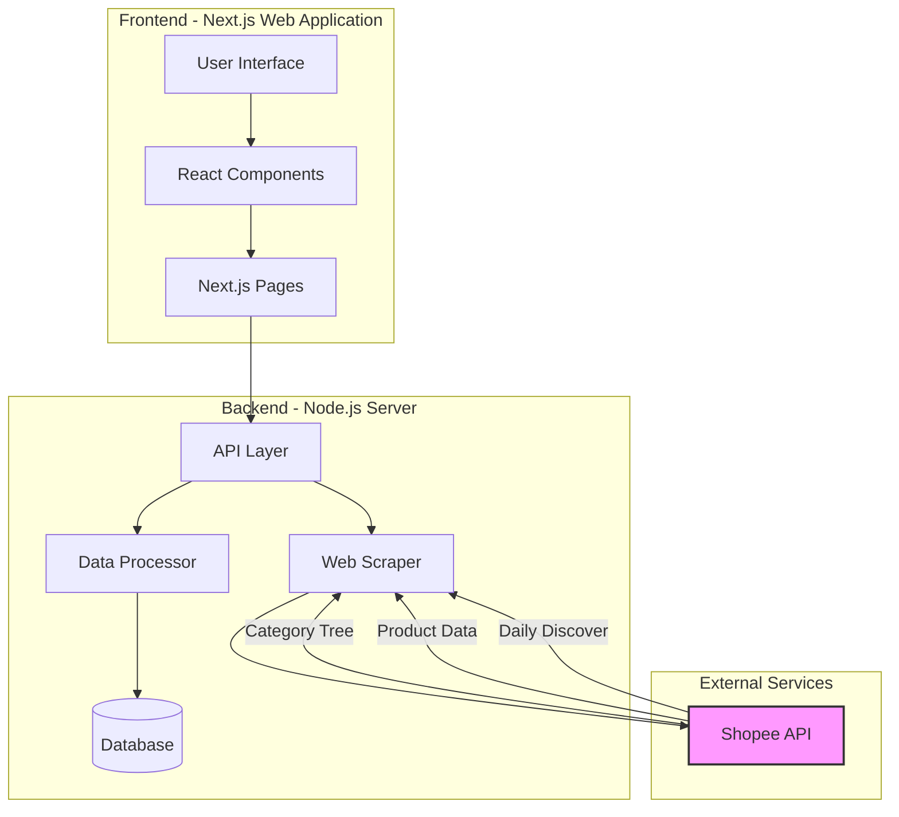

# ETDA Web Scraping Project Architecture

This document outlines the architecture and workflow of the ETDA POC Web Scraping project.

## System Architecture Diagram

## Component Description

### Frontend (Next.js Web Application)
- **User Interface**: Modern, responsive interface built with Next.js and React
- **Components**: Reusable UI components for consistent user experience
- **Pages**: Next.js pages handling routing and data presentation

### Backend (Node.js Server)
- **API Layer**: RESTful API endpoints for frontend communication
- **Web Scraper**: Handles data collection from Shopee API
- **Data Processor**: Processes and transforms scraped data
- **Database**: Stores processed data and application state

### External Services
- **Shopee API**: External data source providing:
  - Category Tree (`/api/v4/pages/get_category_tree`)
  - Main Categories (`/api/v4/pages/get_homepage_category_list`)
  - Daily Product Discovery (`/api/v4/homepage/get_daily_discover`)

## Data Flow

1. The frontend application makes requests to the backend API
2. The backend server processes these requests and coordinates with the scraper
3. The scraper collects data from Shopee's API endpoints:
   - Fetches category hierarchies
   - Retrieves product information
   - Gets daily product discoveries
4. Collected data is processed and stored in the database
5. Processed data is sent back to the frontend for display

## API Integration Points

### 1. Category Tree
- **Endpoint**: `https://shopee.co.th/api/v4/pages/get_category_tree`
- **Purpose**: Retrieves hierarchical category structure

### 2. Main Category
- **Endpoint**: `https://shopee.co.th/api/v4/pages/get_homepage_category_list`
- **Purpose**: Fetches homepage category listings

### 3. Daily Product Discovery
- **Endpoint**: `https://shopee.co.th/api/v4/homepage/get_daily_discover`
- **Parameters**:
  - `bundle`: daily_discover_main
  - `limit`: Number of products to return
  - `offset`: Starting point for results
  - `category_id`: Category filter

## Technology Stack

- **Frontend**:
  - Next.js
  - React
  - TypeScript
  - Tailwind CSS

- **Backend**:
  - Node.js
  - Express.js
  - TypeScript

## Development Guidelines

1. Follow TypeScript best practices for type safety
2. Implement error handling at all API integration points
3. Use environment variables for configuration
4. Follow RESTful API design principles
5. Implement proper rate limiting for API calls
6. Cache responses where appropriate
7. Log important events and errors 